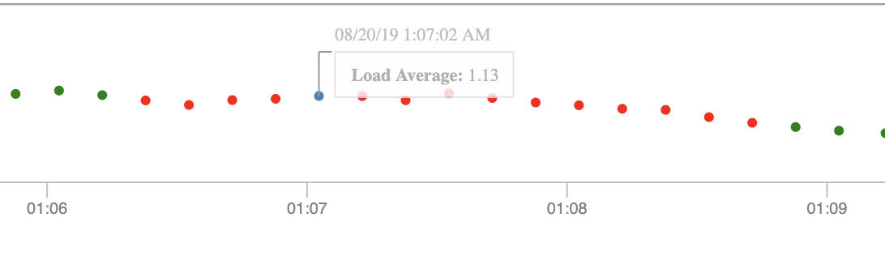

# loading monitoring

## Table of Contents

1. [Set Up](#set-up)
2. [Approach](#approach)
    1. [UI Tasks](#ui-tasks)
    2. [API Tasks](#api-tasks)
3. [Requirements](#requirements)
    1. [API](#api)
    2. [Graph](#graph)
    3. [Alerting](#alerting)
    4. [Design Improvement](#design-improvement)

## Set UP

Software - Node.js v10.11.0

To Load the application locally, you will need to set up the UI and API by running a few npm scripts.

See [UI](./ui/README.md) and [API](./api/README.md) setup.

To test the application alert, you will need to cause your CPU load to break the threshold by putting a lot of load on the CPU with performance-intensive tasks.

* ex:
  * Spin up a few infinite loop node.js applications
  * Open up a lot of applications
  * Run multiple multimedia applications

## Approach

I broke down the work into small tasks to keep track of what needs to be down for this assignment.

### UI Tasks

* React App
  * Configure React Application
  * Configure Webpack
  * Configure State Mangement
  * Connect to API
  * Implement Graph Requirements
  * Implement Alert Requirements
  * Add Tests
  * Add Documentation

### API Tasks

* Express App
  * Configure Express Application
  * Add Dependencies
  * Implement API Requirements
  * Add Tests
  * Add Documentation

## Requirements

### API

* Collect the load averages of your system
  * See Implementation (./api/lib/monitor/service.js)

* There is no need for advanced backends capable of persisting data
  * I chose to create a simple GET API that would perfrom the operation to get the average load on the server from the past minute.

### Graph

* Display in the application the key statistics as well as a history of load over the past 10 minutes in 10s intervals.

### Alerting

* Whenever the load for the past 2 minutes exceeds 1 on average add an alert message.

* Whenever the load average drops again below 1 on average for the past 2 minutes add another message explaining when the alert recovered.

* Make sure all messages showing when alerting thresholds are crossed remain visible on the page for historical reasons.

  * See implementation
    * (./ui/src/components/Graph.js)
    * (./ui/src/components/TimeSeris.js)
